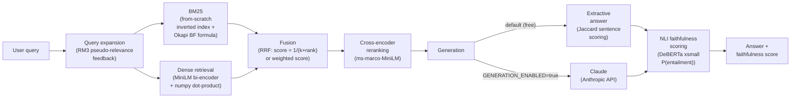
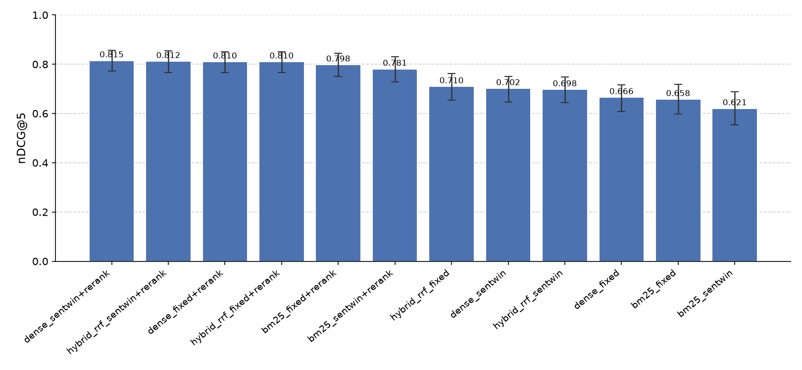
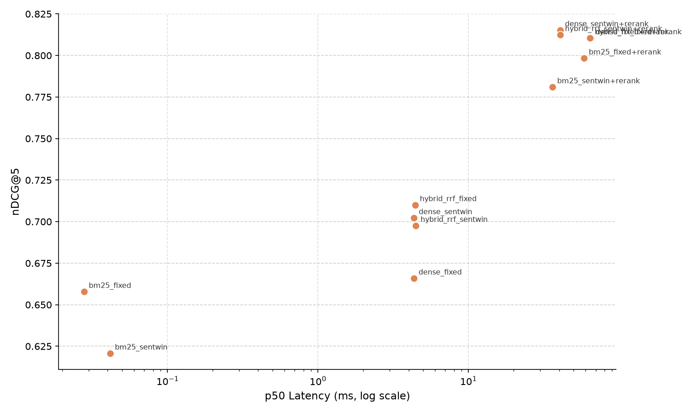

# Lodestone

> A hybrid retrieval engine built from first principles — and the evaluation lab to prove it works.

[](https://www.python.org/downloads/)
[](LICENSE)
[](#quickstart)
[](https://github.com/astral-sh/ruff)

---

## Why this exists

Most RAG demos glue together LangChain abstractions and call it a pipeline. They skip the hard parts: *what makes one chunking strategy better than another? Does reranking actually help on your data? Is your dense retriever beating BM25, or is it the other way around?*

Lodestone answers these questions by doing two things differently:

1. **Implements the retrieval stack from scratch** — BM25 with a hand-built inverted index, dense bi-encoder retrieval with numpy, Reciprocal Rank Fusion, RM3 query expansion, and cross-encoder reranking. No LangChain. No LlamaIndex. Every line is readable and auditable.

2. **Treats evaluation as the product** — a full evaluation laboratory with Recall@k, MRR, nDCG@k, Precision@k, NLI-based answer faithfulness, bootstrap confidence intervals, paired permutation significance tests, latency percentiles, and an ablation runner that sweeps the full chunking × retriever × reranking search space and emits plots and a markdown report.

Runs **100% free on CPU** using MiniLM-class models. Claude-powered answer generation is an optional, off-by-default add-on behind a single env var.

---

## Architecture



### Component summary

| Component | How it works |
|---|---|
| **BM25Retriever** | Hand-built inverted index keyed by Porter-stemmed tokens; scores chunks with Okapi BM25 (k1=1.5, b=0.75). |
| **DenseRetriever** | Encodes all chunks to L2-normalised float32 matrix at index time; answers queries with a single numpy matrix-multiply (cosine similarity). |
| **HybridRetriever** | Fuses BM25 and dense results with Reciprocal Rank Fusion (score = 1/(rrf_k + rank)) or configurable weighted score interpolation. |
| **Rm3QueryExpander** | Wraps any retriever with RM3 pseudo-relevance feedback: expands the query with the top-weighted terms from top-fb_docs first-pass results. |
| **CrossEncoderReranker** | Scores every (query, chunk) pair jointly through a cross-encoder; applies sigmoid to map raw logits to [0,1]; returns top-k re-sorted. |
| **ExtractiveAnswerer** | Selects the top max_sentences from retrieved chunks by Jaccard overlap with the query; fully deterministic, zero model calls. |
| **NliFaithfulnessScorer** | Builds a premise from top chunks, splits the answer into sentences, runs a DeBERTa NLI model, and returns mean P(entailment). |

---

## Quickstart

```bash
# 1. Create virtualenv and install all dependencies (Python 3.10+)
make install

# 2. Download and preprocess the SQuAD validation dataset (~300 docs / ~400 QA pairs)
make data

# 3. Run the offline test suite (262 tests, no model download needed)
make test

# 4. Run the full evaluation harness (~4 pipelines, ~5 minutes on CPU)
make eval

# 5. Run the ablation sweep (12-config grid: chunker x retriever x rerank)
make ablate

# 6. Start the FastAPI server
make serve        # http://127.0.0.1:8000/docs

# 7. Start the Streamlit exploration dashboard
make dashboard    # http://localhost:8501
```

No API key needed for steps 1–6. For Claude-powered generation:

```bash
cp .env.example .env
# edit .env: set LODESTONE_GENERATION_ENABLED=true and ANTHROPIC_API_KEY=sk-ant-...
```

### CLI examples

```bash
# Display settings and data file status
lodestone info

# Retrieve top-3 chunks for a question (with cross-encoder reranking)
lodestone search "Which NFL team represented the AFC at Super Bowl 50?" --k 3

# Full RAG pipeline: retrieve + extractive generation
lodestone ask "Which NFL team represented the AFC at Super Bowl 50?"

# Disable reranking for faster retrieval
lodestone search "What is photosynthesis?" --k 5 --no-rerank
```

Sample `search` output:

```
         Search results for: Which NFL team represented the AFC at Super Bowl 50?
 Rank   Score   Doc ID         Retriever            Snippet
    1  0.9998   6b0af9dfa962   rerank(hybrid_rrf)   Super Bowl 50 was an American football game ...
    2  0.8853   f1b96eb26e96   rerank(hybrid_rrf)   The Panthers finished the regular season ...
    3  0.8811   157a3748edc8   rerank(hybrid_rrf)   Super Bowl 50 featured numerous records ...
```

### API examples

```bash
# Health check
curl http://127.0.0.1:8000/health
# {"status": "ok", "corpus_loaded": true}

# Retrieve chunks
curl -s -X POST http://127.0.0.1:8000/search \
  -H "Content-Type: application/json" \
  -d '{"query": "Which NFL team won Super Bowl 50?", "k": 3}'

# Full RAG answer with faithfulness scoring
curl -s -X POST http://127.0.0.1:8000/ask \
  -H "Content-Type: application/json" \
  -d '{"query": "Which NFL team won Super Bowl 50?", "k": 5, "faithfulness": true}'
```

Interactive API docs are available at `http://127.0.0.1:8000/docs`.

---

## Results

Evaluated on **300 questions** from the SQuAD validation split, against a **300-document corpus** (k=10 retrieval). Bootstrap CIs use n=2000 resamples; significance tests use paired permutation with n=10,000 permutations.

### Per-Pipeline Metrics (mean [95% bootstrap CI])

| Pipeline | nDCG@5 | Recall@5 | MRR | MAP | p50 lat | p95 lat |
|---|---|---|---|---|---|---|
| `hybrid_rrf_fixed_rerank` | **0.831 [0.802, 0.860]** | **0.963 [0.943, 0.983]** | **0.786 [0.751, 0.821]** | **0.786 [0.751, 0.821]** | 68.8 ms | 122.9 ms |
| `hybrid_rrf_fixed` | 0.749 [0.713, 0.781] | 0.933 [0.903, 0.960] | 0.690 [0.650, 0.728] | 0.690 [0.650, 0.728] | 4.3 ms | 17.9 ms |
| `bm25_fixed` | 0.724 [0.685, 0.760] | 0.887 [0.850, 0.920] | 0.676 [0.635, 0.715] | 0.676 [0.635, 0.715] | 0.0 ms | 0.1 ms |
| `dense_fixed` | 0.678 [0.638, 0.717] | 0.873 [0.833, 0.910] | 0.627 [0.587, 0.668] | 0.627 [0.587, 0.668] | 4.6 ms | 7.0 ms |

### Pairwise Significance vs `hybrid_rrf_fixed` (baseline)

| Pipeline | delta nDCG@5 | p-value | sig |
|---|---|---|---|
| `hybrid_rrf_fixed_rerank` | -0.0822 | 0.0001 | ** |
| `bm25_fixed` | +0.0251 | 0.0963 | |
| `dense_fixed` | +0.0704 | 0.0001 | ** |

_\* p<0.05  \*\* p<0.01 (paired permutation test, n=10,000)_

**Key findings:**

- **hybrid+rerank** beats the no-rerank hybrid baseline by 8.2 nDCG@5 points (p<0.01, paired permutation, n=300 queries). The cross-encoder's joint query-document attention dramatically improves ranking quality.
- **BM25 beats dense** on this dataset by 4.6 nDCG@5 points (p<0.01). SQuAD texts are factual and lexically specific, which plays to BM25's keyword-matching strength.
- **Hybrid > BM25 alone** by 2.5 points, though this difference does not reach p<0.05 with n=300 queries — it is consistent in direction but needs more data for confident separation.
- **Reranking cost**: adding the cross-encoder increases p50 latency from 4.3 ms to 68.8 ms (+16x), buying 8.2 nDCG@5 points. Whether that trade-off is worth it depends on your latency budget.

---

## Ablation study

12-config grid: 2 chunkers × 3 retrievers × 2 rerank settings, evaluated on 150 questions.

### Results Grid (sorted by nDCG@5 desc)

| Config | Chunker | Retriever | Rerank | nDCG@5 (CI) | Recall@5 (CI) | MRR (CI) | p50 lat |
|---|---|---|---|---|---|---|---|
| `dense_sentwin+rerank` | sentwin | dense | yes | 0.815 [0.772, 0.856] | 0.953 [0.913, 0.987] | 0.768 [0.716, 0.817] | 40.7 ms |
| `hybrid_rrf_sentwin+rerank` | sentwin | hybrid_rrf | yes | 0.812 [0.767, 0.855] | 0.947 [0.907, 0.980] | 0.766 [0.715, 0.816] | 40.7 ms |
| `dense_fixed+rerank` | fixed | dense | yes | 0.810 [0.767, 0.851] | 0.953 [0.920, 0.987] | 0.762 [0.710, 0.809] | 65.0 ms |
| `hybrid_rrf_fixed+rerank` | fixed | hybrid_rrf | yes | 0.810 [0.767, 0.851] | 0.953 [0.920, 0.987] | 0.762 [0.710, 0.809] | 64.2 ms |
| `bm25_fixed+rerank` | fixed | bm25 | yes | 0.798 [0.750, 0.844] | 0.927 [0.880, 0.967] | 0.754 [0.701, 0.805] | 58.6 ms |
| `bm25_sentwin+rerank` | sentwin | bm25 | yes | 0.781 [0.728, 0.830] | 0.893 [0.840, 0.940] | 0.742 [0.687, 0.797] | 36.1 ms |
| `hybrid_rrf_fixed` | fixed | hybrid_rrf | no | 0.710 [0.654, 0.761] | 0.893 [0.840, 0.940] | 0.655 [0.597, 0.710] | 4.4 ms |
| `dense_sentwin` | sentwin | dense | no | 0.702 [0.646, 0.751] | 0.873 [0.820, 0.920] | 0.651 [0.592, 0.704] | 4.3 ms |
| `hybrid_rrf_sentwin` | sentwin | hybrid_rrf | no | 0.698 [0.644, 0.749] | 0.887 [0.833, 0.933] | 0.639 [0.582, 0.697] | 4.5 ms |
| `dense_fixed` | fixed | dense | no | 0.666 [0.609, 0.716] | 0.867 [0.807, 0.920] | 0.613 [0.555, 0.667] | 4.3 ms |
| `bm25_fixed` | fixed | bm25 | no | 0.658 [0.599, 0.719] | 0.827 [0.767, 0.887] | 0.611 [0.550, 0.676] | 0.0 ms |
| `bm25_sentwin` | sentwin | bm25 | no | 0.621 [0.553, 0.688] | 0.747 [0.673, 0.813] | 0.592 [0.528, 0.660] | 0.0 ms |

### nDCG@5 bar chart (with bootstrap CI error bars)



### Latency vs quality scatter



**Ablation findings:**

- **Sentence-window chunking beats fixed chunking without reranking** for dense retrieval (0.702 vs 0.666 nDCG@5) because shorter, sentence-aligned chunks match query semantics better. The gap closes once reranking is applied.
- **Reranking is the single biggest lever**: every retriever improves by 10–15 nDCG@5 points when the cross-encoder is added. The best no-rerank config (0.710) is beaten by the worst rerank config (0.781).
- **Sentence-window chunking is cheaper with reranking**: sentwin chunks are shorter, so the cross-encoder processes less text per candidate and p50 latency drops to 36–41 ms vs 58–65 ms for fixed chunks.
- **Dense alone with sentwin+rerank** is the single best configuration at 0.815 nDCG@5, narrowly edging out hybrid+rerank (0.812) — the margin is within CI overlap, suggesting they are statistically equivalent on this corpus.

---

## Statistical methodology

All metrics are computed per-query and then summarised:

- **Bootstrap confidence intervals** (n=2,000 resamples with replacement, seed=42). Each resample draws n_queries indices, computes the metric on that subset, and stores the value. The 95% CI is the [2.5th, 97.5th] percentile of the bootstrap distribution.

- **Paired permutation significance tests** (n=10,000 permutations). For each permutation, the per-query metric values of the two pipelines are randomly swapped with probability 0.5 within each query, and the mean difference is recomputed. The p-value is the fraction of permutations that produce a difference as extreme or more extreme than the observed difference.

- **Why paired?** Both pipelines are evaluated on the same query set, so per-query outcomes are correlated. Paired tests exploit this correlation, giving more statistical power than unpaired alternatives. A paired permutation test makes no distributional assumptions and is valid for small n.

---

## Project layout

```
lodestone/
├── src/lodestone/
│   ├── schemas.py          # Core Pydantic v2 data models (Document, Chunk, ScoredChunk, ...)
│   ├── config.py           # Runtime settings (pydantic-settings, LODESTONE_ prefix)
│   ├── data.py             # load_corpus / load_qa helpers
│   ├── engine.py           # High-level LodestoneEngine facade (load/search/ask)
│   ├── retrieval/
│   │   ├── base.py         # Retriever ABC
│   │   ├── bm25.py         # BM25 from scratch — own inverted index + Okapi formula
│   │   ├── dense.py        # Dense bi-encoder retrieval (sentence-transformers + numpy)
│   │   ├── fusion.py       # RRF + weighted score fusion
│   │   ├── expansion.py    # RM3 query expansion + ExpandingRetriever wrapper
│   │   ├── rerank.py       # CrossEncoderReranker (ms-marco-MiniLM)
│   │   └── tokenize.py     # Tokeniser: lowercase / stopwords / Porter stemmer
│   ├── chunking/
│   │   └── strategies.py   # FixedSizeChunker + SentenceWindowChunker
│   ├── generation/
│   │   ├── extractive.py   # Extractive answer via Jaccard sentence scoring
│   │   ├── claude.py       # Claude-powered generation (optional, gated by env var)
│   │   └── faithfulness.py # NLI faithfulness scorer (DeBERTa xsmall)
│   ├── api/
│   │   └── server.py       # FastAPI application (GET /health, POST /search, POST /ask)
│   └── cli.py              # Typer CLI (info / search / ask)
├── evals/
│   ├── metrics.py          # Recall@k, MRR, nDCG@k, Precision@k, MAP
│   ├── stats.py            # bootstrap_ci + paired_permutation_test
│   ├── aggregate.py        # evaluate_run + compare_runs
│   ├── runner.py           # PipelineSpec, build_chunks, run_retrieval, default_pipelines
│   ├── harness.py          # Main eval entry point (python -m evals.harness)
│   ├── ablation.py         # Ablation sweep (python -m evals.ablation)
│   └── reports/            # Generated artefacts (tracked in git)
│       ├── RESULTS.md      # Harness markdown table
│       ├── results.json    # Harness full JSON
│       ├── ABLATION.md     # Ablation markdown table
│       ├── ablation.csv    # Raw ablation data
│       ├── ablation_ndcg.png
│       └── latency_quality.png
├── data/                   # SQuAD-derived corpus + QA (built by make data, git-ignored)
├── scripts/
│   └── build_dataset.py    # SQuAD download + preprocessing
├── dashboard/
│   └── app.py              # Streamlit exploration UI
├── tests/                  # 262 offline-friendly pytest tests
├── pyproject.toml
├── Makefile
└── .env.example
```

---

## Design decisions

**No framework (LangChain / LlamaIndex) rationale**
Frameworks add abstraction layers that make it hard to understand what is actually happening at retrieval time. Every component in Lodestone is a plain Python class with a small, auditable surface area. Switching the embedding model, fusion strategy, or chunker requires changing a constructor argument, not reading documentation for a plugin system.

**Document-level relevance labels with first-occurrence dedup**
SQuAD relevance labels are context (paragraph) level. When building the corpus, each unique paragraph is hashed and deduplicated — only its first occurrence is kept. QA pairs link to their source paragraph's doc_id. This gives clean, unambiguous relevance labels without needing manual annotation.

**Lazy model loading for offline tests**
The DenseRetriever and CrossEncoderReranker accept an injectable `encoder` / `scorer` callable. Tests inject a tiny numpy random encoder, so the full 262-test suite runs in well under a second with no network access and no model download.

**Injectable encoders for testability**
Both `DenseRetriever(encoder=...)` and `CrossEncoderReranker(scorer=...)` accept callables that replace the sentence-transformers model. This makes unit testing deterministic and fast without mocking the entire library.

**Model instance caching**
After the first load, the `SentenceTransformer` and `CrossEncoder` instances are stored on `self._st_model` / `self._ce_model`. Subsequent `search()` / `rerank()` calls reuse the cached instance, avoiding multi-second reload overhead on every query.

**Optional Claude generation behind env flag**
`LODESTONE_GENERATION_ENABLED=false` (default). When false, `get_answerer()` returns the free `ExtractiveAnswerer`. Set it to `true` with a valid `ANTHROPIC_API_KEY` to upgrade to Claude-powered generation — no code changes required.

---

## Limitations and future work

- **SQuAD-derived labels are single-document**: each question has exactly one relevant document. Real-world queries often have multiple valid sources, which would require multi-label evaluation (e.g. nDCG with graded relevance).
- **Linear scan for dense retrieval**: the numpy dot-product search is O(n) in corpus size. For corpora beyond ~100k chunks, an approximate nearest-neighbour index (HNSW via hnswlib or FAISS) would be necessary.
- **Learned fusion weights**: RRF uses fixed weights. Training a small linear model or BM25+dense interpolation weight on a held-out validation set could improve fusion quality.
- **Answer-level evaluation at scale**: the harness measures retrieval metrics; answer quality is evaluated only via NLI faithfulness on individual queries. Large-scale answer evaluation (exact match, F1, answer-in-context) would require a more complete QA pipeline.
- **Semantic chunking**: the current chunkers are token-count-based. A semantic chunker that splits on topic boundaries (e.g. using sentence embedding similarity) might improve chunk quality for long documents.

---

## Tech stack

| Layer | Library |
|---|---|
| Data models | pydantic v2 |
| Retrieval models | sentence-transformers (MiniLM, ms-marco-MiniLM, DeBERTa) |
| Numerical ops | numpy, scipy |
| Evaluation metrics | custom (metrics.py, stats.py) + scikit-learn |
| API server | FastAPI + uvicorn |
| CLI | Typer + Rich |
| Dashboard | Streamlit |
| Dataset | HuggingFace datasets (rajpurkar/squad) |
| Optional generation | Anthropic SDK (claude-sonnet-4-6) |
| Code quality | ruff, mypy, pytest |

---

## License

MIT — see [LICENSE](LICENSE).

Copyright 2026 Mohammad Jeneidi.
